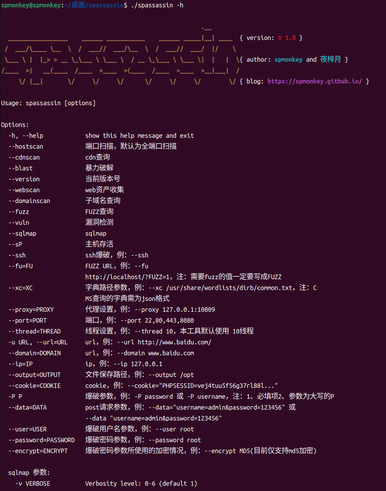

# spassinV1.1扫描工具使用说明

> 新增功能

+ 只修改了端口扫描
    + 1、-o,--outout 保存输出
    + 2、-p,--port 指定端口扫描 默认全端口扫描
    + 修改端口扫描参数 --port --> --portscan
+ 为domainscan修改参数 --url --> --domain

> 使用方法

python spassin.py -h

+ 注：
   + 1、本程序默认线程数为 10，线程数可调，参数为：-t/--thread 
   + 2、本程序支持设置代理，不过仅限 webscan、domain参数

> cdn查询

* python spassin.py --cdnscan --domain www.baidu.com

> 端口扫描

* python spassin.py --portscan -i 192.168.111.129 -t 1000

* python spassin.py --portscan -i 192.168.111.129 -t 1000 -p 22,80,135,443,445,3306,3389

> web资产收集

* python spassin.py --webscan -u www.hscsec.cn -t 50

* python spassin.py --webscan --url www.hscsec.cn --thread 50 --proxy 127.0.0.1:10809

**注：webscan可以通过 proxy参数 进行本地全局代理的配置**

> 子域名查询

* python spassin.py --domainscan --domain hscsec.cn -t 50

