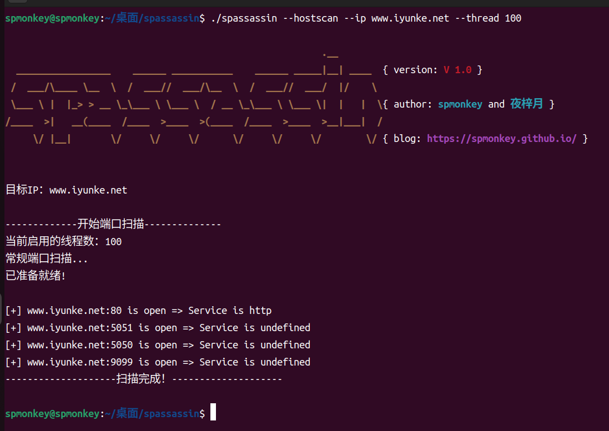
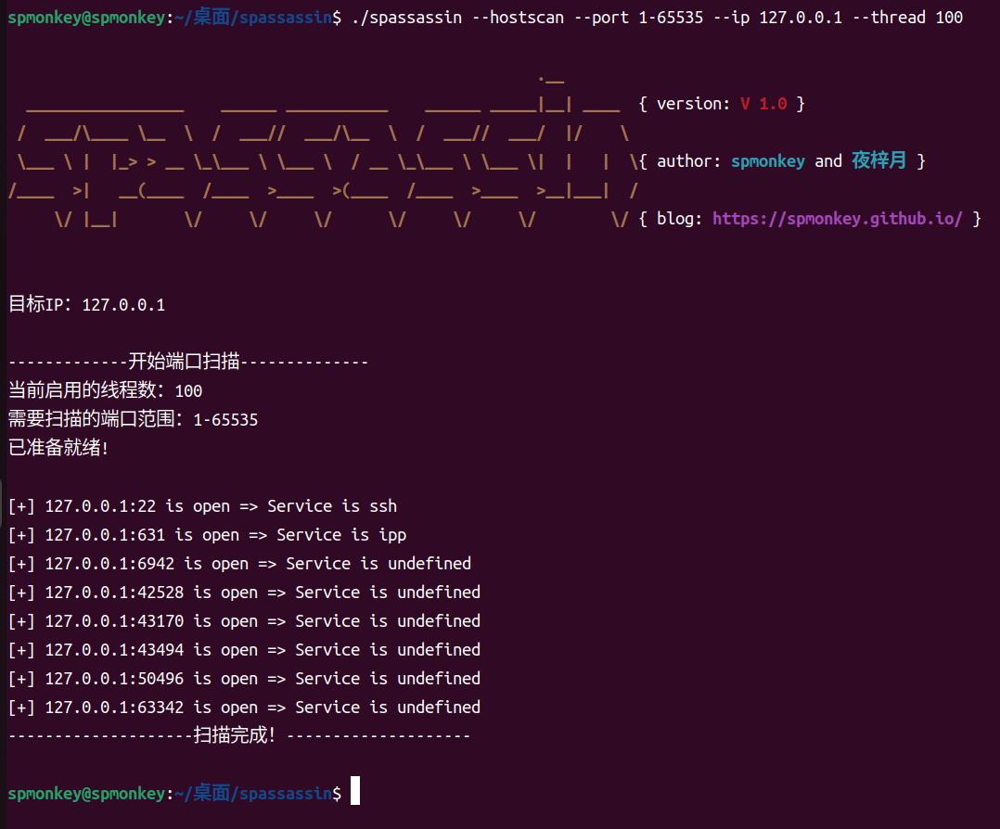
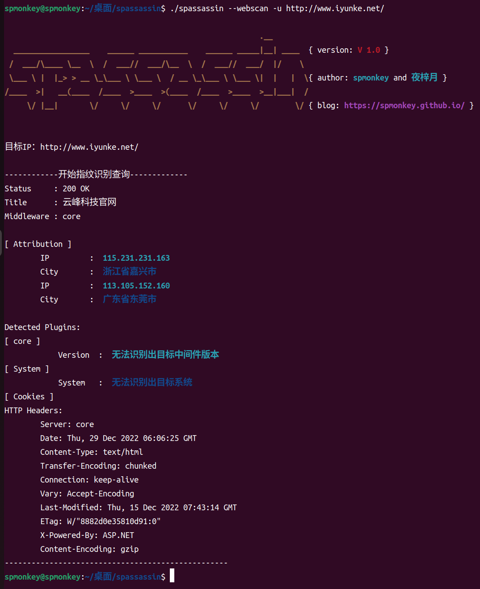
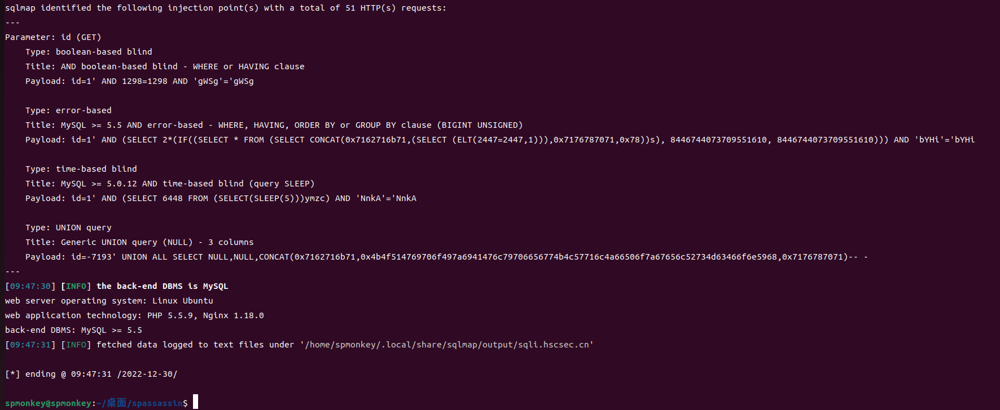

# spassassinV1.0渗透工具使用说明

> 主要功能
+ 1、信息收集：
  + 端口扫描
  + web基本信息收集
  + cdn检测
  + 子域名查询
+ 2、爆破功能：
  + 登录框的密码爆破，支持密码的md5加密爆破
+ 3、漏洞扫描：
  + 常见OA的高危漏洞（致远、蓝凌、金蝶、万户、通达、用友）
  + log4j(CVE-2017-5645)
+ 4、漏洞利用：
  + 根据漏洞扫描所检测到的存在的系统漏洞，将会生成对应的攻击模块
  + 部分攻击可以直接连接生成的冰蝎马
+ 5、sqlmap：
  + 集成了sqlmap
+ 6、其他功能：
  + 文件保存 
  + ip代理

> 使用方法

* ./spassassin -h

注：1、本程序默认线程数为 10，线程数可调，参数为：--thread
   2、本程序支持设置代理，不过仅限 webscan、domain参数

> cdn检测

* ./spassassin --cdnscan --domain www.iyunke.net

> 端口扫描

* ./spassassin --hostscan --ip www.iyunke.net --thread 100

ps：默认为1000个常规端口扫描
* ./spassassin --hostscan --port 1-65535 --ip 127.0.0.1 --thread 100

> web资产收集

* ./spassassin --webscan -u http://www.iyunke.net/

> 子域名查询

* ./spassassin --domainscan --domain hscsec.cn --thread 50 

> 暴力破解

* ./spassassin --blast -u "http://192.168.111.128:81/vulnerabilities/brute/?username=admin&password=password&Login=Login" --cookie="PHPSESSID=lq8l2qvgig3qmj9hhupg9fgbk4; security=low" -P password --xc /home/spmonkey/桌面/spassassinV1.4/library/password.txt --thread 100

> sqlmap

* --sqlmap 参数后接sqlmap的正常参数即可
* ./spassassin --sqlmap -u "https://sqli.hscsec.cn/Less-1/?id=1"

> 漏洞检测模块

* ./spassassin --vuln -u "http://192.168.111.131/"

* attack模块

#                  鸣谢
起名：Fx42S 开发人员：夜梓月，我有一个小秘密，SpMonkey 思路提供者：Fx42S，Kayden
